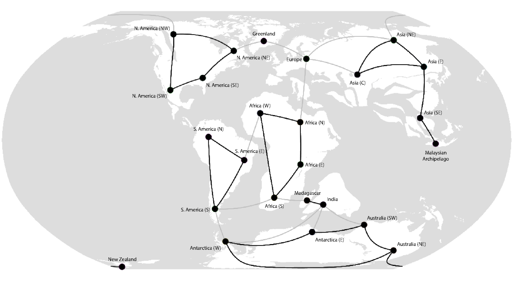
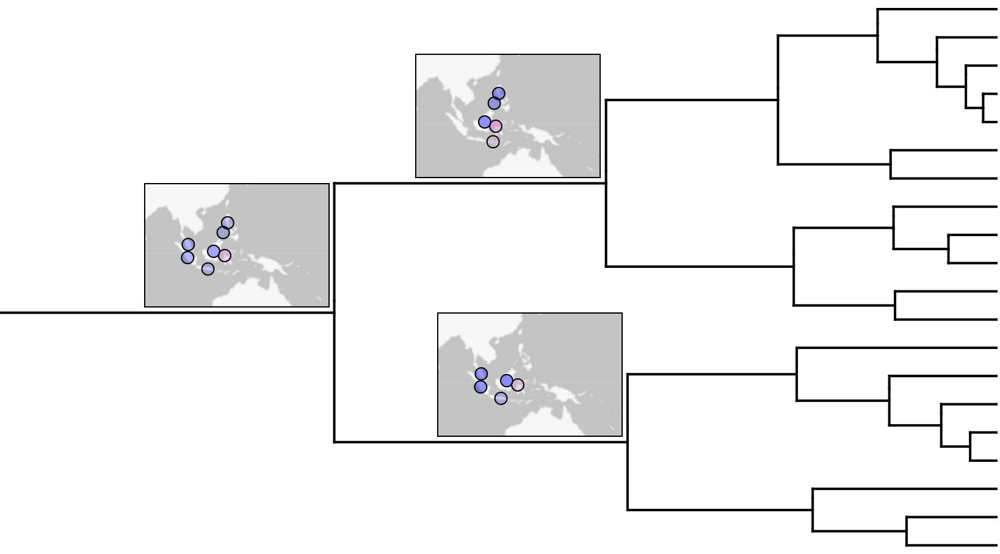
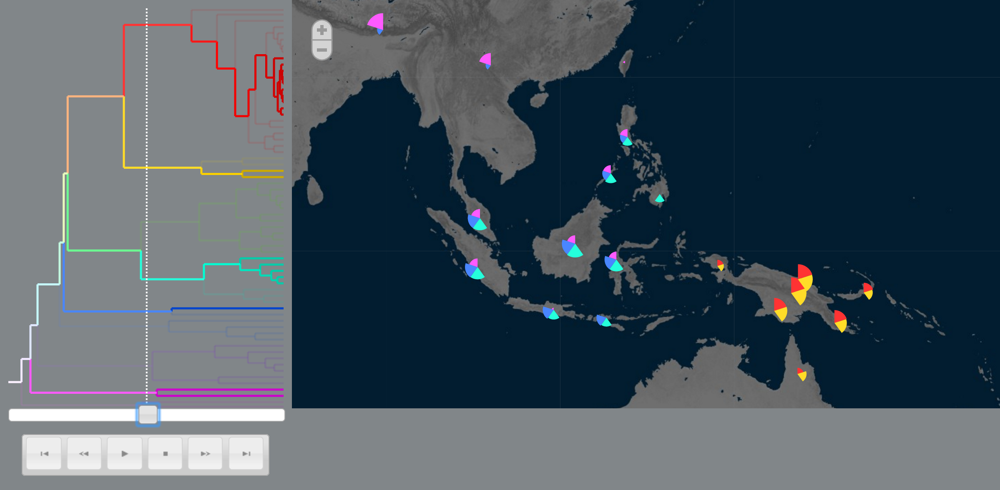
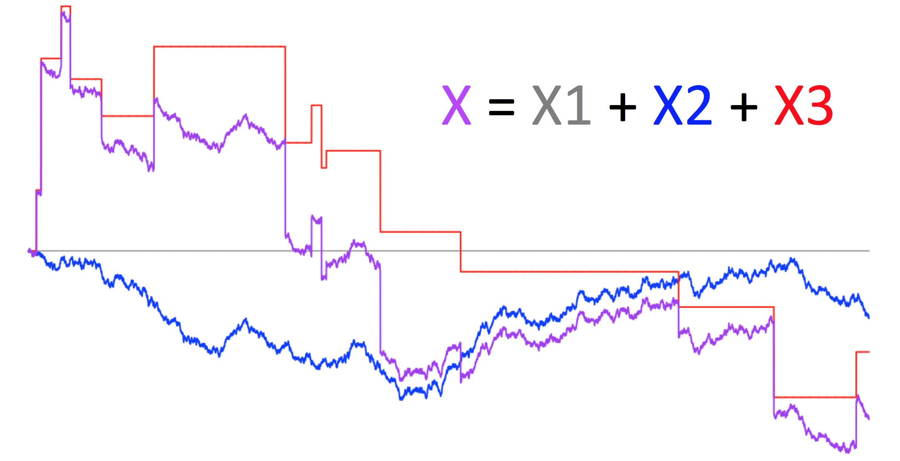
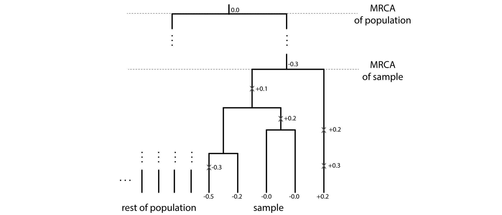
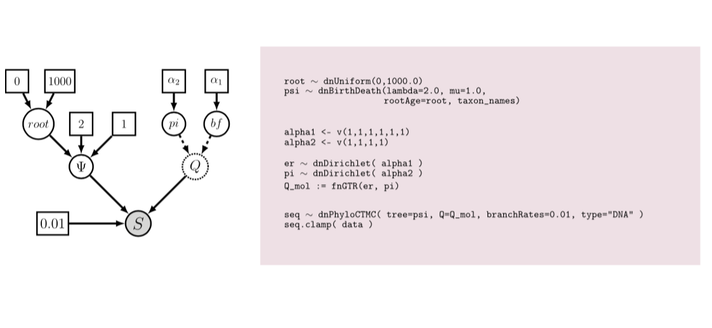
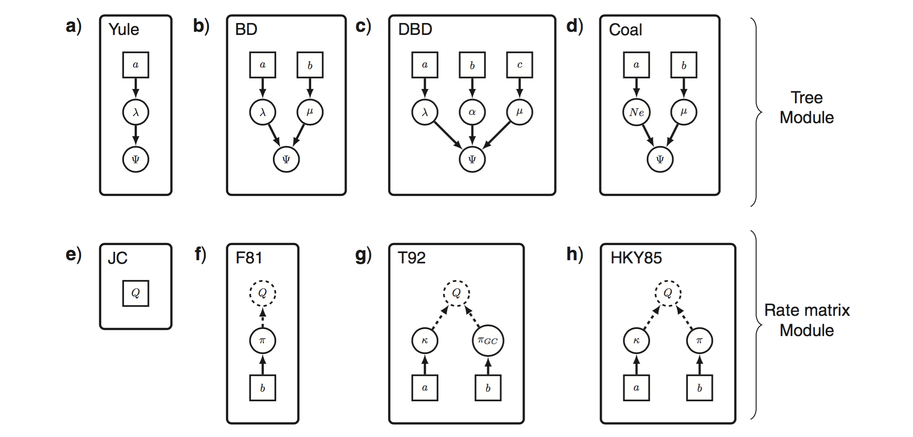

<h1>Research</h1>

Models of evolutionary processes help us understand how biodiversity is generated, sustained, and lost.
Due to technological and mathematical reasons, statistical phylogenetic research has largely focused on models of molecular evolution.
Two of the most salient aspects of biodiversity, the morphological and geographical variation of species, have a rich theoretical histories in biology, but lack statistical tools to test longstanding theories.

My primary research interests include **statistical phylogenetics**, **Bayesian inference**, **historical biogeography**, and **quantitative trait evolution**.
I study evolution by developing probabilistic models, writing open source and community-minded software, and analysing simulated and empirical data.
These methods are available as open source software (see below).
I maintain a strong and general interest in phylogenetic inference, and serve as an active core developer for [RevBayes](http://revbayes.com), an open-source package for modeling evolutionary processes and estimating trees.

### Historical biogeography

Historical biogeography studies the distribution of species in space and time.
Because many species have no known fossil record, biogeographers often rely on reconstructing ancestral species ranges to understand how ranges changes over time.
Only recently, parametric models have been used in a phylogenetic context to estimate ancestral species ranges, represented presence-absence states for sets of discrete areas.
Methodologically, I am interested in techniques to allow the models to be applied to high-resolution, global-scale datsets.
For models, I am interested how biogeographic inference may improve phylogenetic estimates.

##### Related work

**Landis, M. J.** (2015). Biogeographic dating of speciation times using paleogeographically informed processes. Systematic Biology, syw040.
 [[paper](../assets/research/pdf/Landis_2016_SystBiol_biogeographic_dating.pdf)]  [[software](http://github.com/mlandis/biogeographic_dating)]

**Landis, M. J.**, Matzke, N. J., Moore, B. R., & Huelsenbeck, J. P. (2013). Bayesian Analysis of Biogeography when the Number of Areas is Large. Systematic Biology, 62(6), 789.
 [[paper](../assets/research/pdf/Landis_et_al_2013_SystBiol_biogeography_many_areas.pdf)]  [[software](http://software.google.com/p/archive/bayarea)]

**Landis, M. J.**, & Bedford, T. (2014). Phylowood: interactive web-based animations of biogeographic and phylogeographic histories. Bioinformatics, 30(1), 123-124.
 [[paper](../assets/research/pdf/Landis_Bedford_2014_Bioinfo_phylowood.pdf)]  [[software](http://mlandis.github.io/phylowood)]

### Quantitative trait evolution

Darwin's original conception of evolution proposed species evolve gradually over time.
In phylogenetics, this is often modeled as a Brownian motion, whereby small changes occur over many small intervals of time.
Many evolutionary mechanisms, such as rapid adaptation, may produce "bursts" in variation, with punctuated change of large effect.
Rapid change should produce power-law (or heavy-tailed) distributions of traits, but Brownian motion does not generate this feature.
It is difficult to detect these bursts if they are not modeled appropriately.
To search for signals of punctuated evolution, I apply a flexible class of stochastic processes that produce gradual and/or punctuational patterns of change, called Lévy processes.

##### Related work

**Landis, M. J.** (\*), Schraiber, J. G. (\*), & Liang, M. (2013). Phylogenetic Analysis Using Lévy Processes: Finding Jumps in the Evolution of Continuous Traits. Systematic Biology, 62(2), 193.
 [[paper](../assets/research/pdf/Landis_et_al_2012_SystBiol_phylo_levy.pdf)]  [[software](http://github.com/mlandis/creepy-jerk)]

Schraiber, J. G., and **Landis, M. J.**. (2015). Sensitivity of quantitative traits to mutational effects and number of loci. Theoretical population biology,  102: 85-93.
 [[paper](../assets/research/pdf/Schraiber_Landis_2014_TPB_quant_coalescent.pdf)]  [[software](http://github.com/Schraiber/quant_trait_coalescent)]

(\*) - Lead author.

### Phylogenetic inference

Learning the degree of relatedness between species has far-reaching implications for biological research, from basic research questions in evolution and ecology, to applied questions in medical research, epidemiology, forensics, and biodiversity management.
Estimating a phylogeny, of course, depends on one's model assumptions, which vary depending on the nature of the study.
[RevBayes](http://revbayes.com) was designed to allow researchers to tailor models to their needs.
RevBayes achieves this by providing a flexible scripting language to describe probabilistic graphical models.

##### Related work

Höhna, S., **Landis, M. J.**, Heath, T. A., Boussau, B., Lartillot, N., Moore, B. R., Huelsenbeck, J. P. & Ronquist, F. (2016). RevBayes: Bayesian Phylogenetic Inference Using Graphical Models and an Interactive Model-Specification Language. Systematic Biology, syw021.
 [[paper](../assets/research/pdf/Hoehna_et_al_2016_SystBiol_revbayes.pdf)]  [[software](http://github.com/revbayes/revbayes)]

Höhna, S., Heath, T. A., Boussau, B., **Landis, M. J.**, Ronquist, F., & Huelsenbeck, J. P. (2014). Probabilistic graphical model representation in phylogenetics. Systematic Biology, 63(5), 753-771.
 [[paper](../assets/research/pdf/Hoehna_et_al_2014_SystBiol_graphical_models.pdf)]
